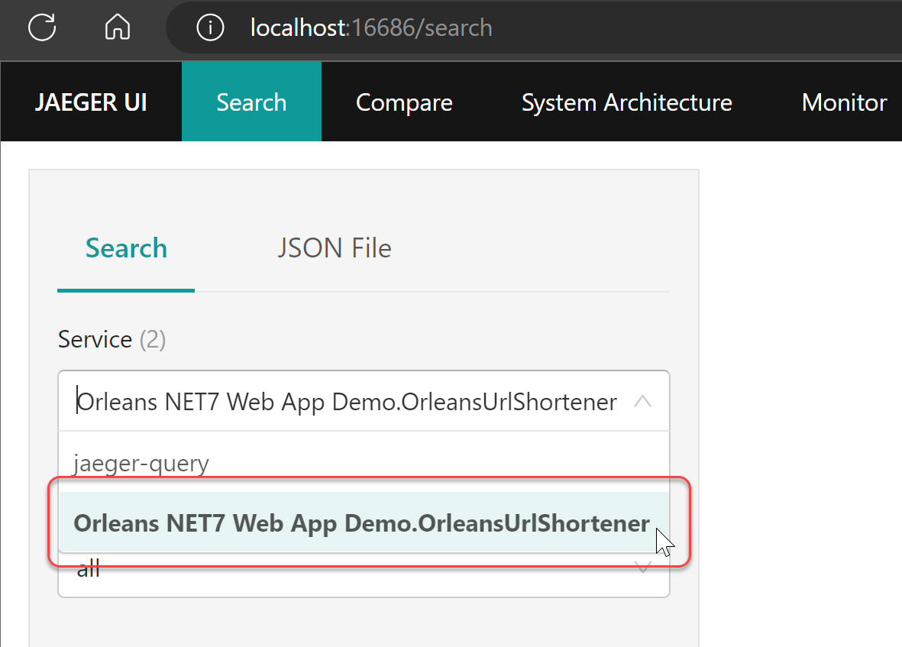
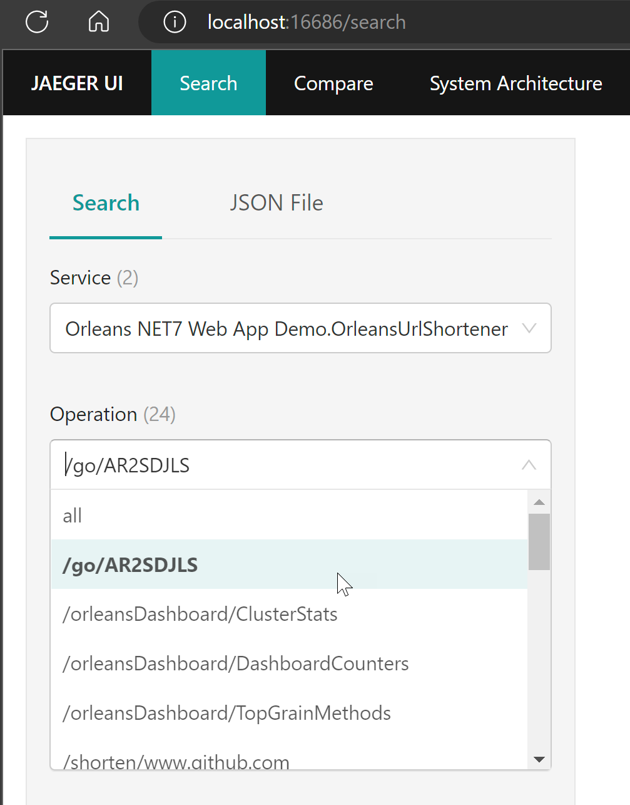
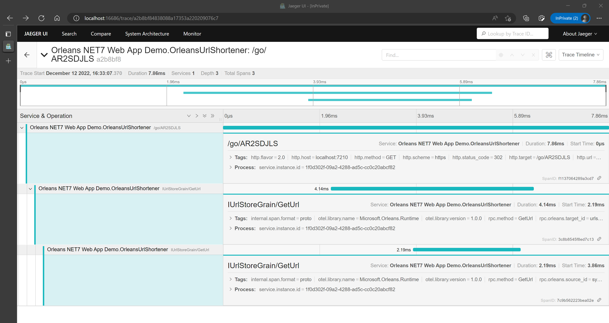

# Using Jaeger as local development tracing visualizer

1. Download Jaeger from https://www.jaegertracing.io/download/ or using the ["**all-in-one**" docker image](https://hub.docker.com/r/jaegertracing/all-in-one) to run Jaeger locally.
2. Now it should be able to open the Jaeger UI at http://localhost:16686 
3. Start the `src/OrleansNet7UrlShortener` project locally, and make some shorten Url requests, and check if the shorten url can be navigated to.
4. The Left upper side of the Jaeger UI should have the service "Orleans NET7 Web App Demo.OrleansUrlShortener" entry in Service column.
    
5. Click the "Orleans NET7 Web App Demo.OrleansUrlShortener" entry in Service column, then you should be able to see many selectable entries on the next "Operations" field:
    
6. Select an entry like the above image, then click the "**Find Traces**" button on bottom left of the page, then you should be able to see the tracing details:
    