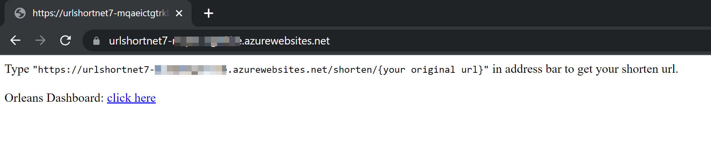

# OrleansNet7UrlShortener

Microsoft Orleans example project on [Microsoft Learn course: Build your first Orleans app with ASP.NET Core 7.0](https://learn.microsoft.com/en-us/training/modules/orleans-build-your-first-app) demonstrates [Smart Cache Pattern](https://github.com/OrleansContrib/DesignPatterns/blob/master/Smart%20Cache.md)

Add some other error prevention, add Orleans Dashboard and successful deploy to Azure WebApp.

To get a deployable Azure App Service (Windows) Environment, you need to install [Azure CLI](https://learn.microsoft.com/cli/azure/) and follow instructions [here](./Infra/Azure/AppService_windows/README.md).